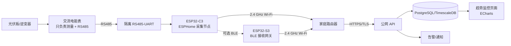
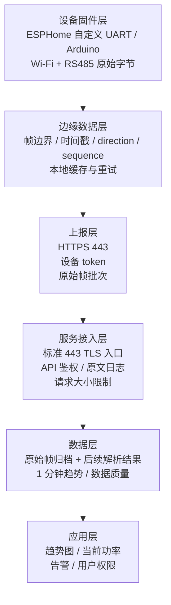

# 光伏功率实时监控方案（1.5 kW 单站点）

> 版本：v0.8（DL/T 645-2007 原始帧上报与双入口部署）  
> 日期：2026-08-16  
> 目标：先用一套经济、可维护的架构实时观察约 1500 W 光伏系统的功率变化，再平滑扩展到多个测量点。

> **本版架构修订**：逆变器没有数据接口，电表通过 RS485 输出 DL/T 645-2007 报文。ESP8266/ESPHome 采集节点不解析数据标识、数据域、校验和或功率单位，只把 RS485 收到/发出的完整原始帧转成 `frame_hex` 上传。服务器先按日志原样记录，后续解析服务再生成 `power_w`、`energy_wh` 等趋势数据。公网域名只使用受信任证书的标准 HTTPS；不开放旧版兼容端口、不使用自签证书。裸公网 IP 仅作为受控网络的 HTTP 联调入口。

## 1. 结论先行

先把设备关系说清楚：



- 先监控“总输出功率”一个测量点，而不是一开始给每块板配一个节点。约 1.5 kW 的系统通常先看逆变器交流总输出，成本、布线和维护量最低。
- 由于逆变器没有可用数据接口，第一版直接测量逆变器后的交流输出侧：采用带隔离、带 RS485 的交流电能表，由采集节点采集 DL/T 645-2007 原始帧；功率和累计电量由服务器后续解析得到。
- 默认按单相 220 V 设计；如果现场是三相输出，替换为三相电能表并保留同样的 Wi-Fi/API 链路，BLE 仅在覆盖不好时启用。不要把普通分压电路直接接到高压直流组串。
- 家庭现场已有 Wi-Fi，第一版优先让 ESP32 直接通过 2.4 GHz Wi-Fi 和 HTTPS 上传，取消一跳 BLE，硬件和软件都更简单。
- 如果电表在金属配电箱内、Wi-Fi 覆盖不好，保留“ESP32-C3 BLE 采集节点 + ESP32-S3 Wi-Fi 网关”双板架构；这条路径需要定制 BLE 固件，不是普通 ESPHome 配置即可完成。
- 第一版不引入 MQTT Broker、Kafka 或复杂 IoT 平台，减少运维成本；后续设备数量明显增加时再切换。
- 采集节点按电表问答周期收集原始帧，按 1～100 帧批次上传；如果启用 BLE，网关只转发原始帧，不做业务解析。服务端先写入日志/原始归档，再由解析任务生成 1 分钟趋势数据。目标是页面延迟小于 10 秒，而不是在单片机上计算业务值。

### 1.1 设备角色分别做什么？

不要把“电表、采集模块、BLE、网关”理解成四个都要买的盒子。`BLE` 是通信方式，不是一个独立设备；家庭 Wi-Fi 直连方案的最小硬件只有电表、隔离 RS485、ESP32 和电源，BLE 网关是可选扩展：

| 部件 | 它做什么 | 它不做什么 | 典型接口 |
| --- | --- | --- | --- |
| **交流电能表** | 接在逆变器 AC 输出支路，测量并按 DL/T 645-2007 返回报文 | 不上网、不发 BLE、不调用服务器 API | 交流端子 + RS485 |
| **ESP32 采集节点** | 通过隔离 RS485 收发完整原始帧，附加设备身份/序号后上传 | 不解析数据标识、不换算 `power_w`，不直接测高压交流 | 隔离 RS485 + Wi-Fi；可选 BLE |
| **BLE 接收网关（可选）** | 当采集节点不方便上 Wi-Fi 时，原样转发 BLE 收到的帧，再用 Wi-Fi 上传 | 不解析 DL/T 645、不直接测高压交流 | BLE Central + 2.4 GHz Wi-Fi |
| **家庭路由器** | 给 ESP32 提供 2.4 GHz 局域网和公网出口 | 不读取电表、不存业务历史 | 2.4 GHz Wi-Fi + Internet |
| **服务器** | 校验、存储、画趋势图、发告警 | 不直接连接电表或 BLE | HTTPS API + 数据库 |

最重要的一句：

推荐主链路：

> **电表 → RS485 → ESP32/ESPHome → 家庭 Wi-Fi → HTTPS → 服务器。**

可选 BLE 链路：

> **电表 → RS485 → ESP32-C3/BLE → BLE → ESP32-S3/Wi-Fi → HTTPS → 服务器。**

所以电表和 BLE 的关系是“电表输出 RS485，ESP32 负责协议转换；需要无线隔离时才由 ESP32 发 BLE”，不是电表自己带 BLE。

### 1.2 一条数据是怎么走的？

以电表返回一条原始帧为例：

1. 电表在逆变器交流输出侧测量，并通过 RS485 返回 DL/T 645-2007 原始报文。
2. 采集节点记录发送帧和接收帧的完整字节，转换为偶数长度的 `frame_hex`，附上 `captured_at`、`direction` 和 `sequence`。
3. Wi-Fi 直连节点通过标准 HTTPS 443 上传；BLE 扩展中，采集节点先把同一原始帧交给网关，网关不得改写帧内容。
4. 服务端校验设备身份和传输格式，将每条原始帧写入日志；日志不代表已经得到 `power_w`。
5. 后续解析任务读取原始帧，按 DL/T 645-2007 解码数据标识、数据域和校验，再生成可画趋势的业务测量。

如果 Wi-Fi 或公网短暂断开，ESP32 先缓存原始帧；如果使用 BLE 扩展，BLE 断开时采集节点先缓存，网关断网时网关再缓存。恢复后按原 `sequence` 和原 `frame_hex` 补传。

### 1.3 你是否只需要接一只电表？

如果目标是监控**逆变器交流总输出功率**，是的，通常只需要在逆变器 AC 输出支路安装一只交流电能表。电能表同时测量电压、电流、有功功率和累计电量，ESP32 通过 RS485 读取；Wi-Fi 直连时直接上报，保留 BLE 时再转发给 Wi-Fi 网关。不需要再分别购买电压传感器和电流传感器。

```text
光伏板 → 逆变器 → 交流断路器 → [交流电能表] → 负载/电网
                                      │
                              隔离 RS485
                                      │
                              ESP32 采集节点
```

这只电表必须安装在**逆变器自己的输出支路**，不能装在家庭总进线或电网总表位置，否则读到的是负载/电网的净交换功率，而不是光伏逆变器的发电功率。交流接线、断路器和防护箱由有资质的电工施工。

### 1.4 两种经济架构怎么选？

#### 方案 A：Wi-Fi 直连（默认推荐）

```text
电表（RS485）
      │ 有线
      ▼
ESP32-C3（ESPHome + 隔离 RS485 + Wi-Fi）
      │ HTTPS 公网
      ▼
服务器 API
```

适合电表位置能覆盖稳定的 2.4 GHz Wi-Fi。ESP32 同时承担读表、缓存、Wi-Fi 和 HTTPS 上报，设备数量最少，最适合第一台验证。

单站点 DIY 硬件粗估：

| 部件 | 经济型参考价 |
| --- | ---: |
| 正泰 DDSU666 RS485 电表 | 75～130 元 |
| ESP32-C3 开发板 | 25～60 元 |
| 隔离 RS485 模块 | 15～35 元 |
| 电源、外壳、端子和线材 | 40～90 元 |
| **合计** | **155～415 元**，不含电工安装和宽带费用 |

#### 方案 B：保留 BLE（Wi-Fi 覆盖不好时）

```text
电表（RS485）
      │ 有线
      ▼
ESP32-C3 采集节点（RS485 + BLE）
      │ BLE
      ▼
ESP32-S3 接收网关（BLE + Wi-Fi）
      │ HTTPS 公网
      ▼
服务器 API
```

电表附近的 ESP32-C3 不必接入 Wi-Fi，只负责读表和 BLE；ESP32-S3 放到 Wi-Fi 信号更好的位置。代价是增加一块板、一套电源和 BLE 配对/缓存软件。

单站点 DIY 硬件粗估：

| 部件 | 经济型参考价 |
| --- | ---: |
| 正泰 DDSU666 RS485 电表 | 75～130 元 |
| ESP32-C3 采集节点 | 25～60 元 |
| 隔离 RS485 模块 | 15～35 元 |
| ESP32-S3 Wi-Fi 网关 | 45～80 元 |
| 两套电源、外壳、端子和线材 | 60～120 元 |
| **合计** | **220～525 元**，不含电工安装和宽带费用 |

方案 A 是默认开发路径；方案 B 只在电表位置 Wi-Fi 覆盖差、金属配电箱屏蔽明显或希望集中放置网关时采用。

#### 经济型最终建议

- **默认先做方案 A**：确认支持 `DL/T 645-2007` 的正泰 `DDSU666` + 隔离 RS485 + ESP8266-12F/ESP32 + 原始帧采集固件 + Wi-Fi HTTPS。
- **只有 Wi-Fi 覆盖不够时再做方案 B**：ESP32-C3 采集节点 + ESP32-S3 BLE/Wi-Fi 网关。
- BLE 的价值是把“电表附近的读表节点”和“有稳定 Wi-Fi 的网关”分开，不会提高电表测量精度。

考虑到你是家庭 Wi-Fi 场景，本项目默认落地**方案 A（Wi-Fi 直连 + ESPHome）**；方案 B（BLE + Wi-Fi 双板）保留为现场覆盖不佳时的扩展。两种方案都不需要 4G、SIM 卡或物联网卡。

### 1.5 Mac 开发环境结论

有官方 macOS 开发程序：**ESPHome Device Builder**，支持 macOS 10.15 Catalina 及更新版本，并提供 Apple Silicon（M 系列）和 Intel 安装包。它不是只能查看日志的工具，而是可以创建 YAML、编译固件、第一次通过 USB 刷写、查看串口日志，之后通过 Wi-Fi OTA 更新。

因此推荐的开发组合是：

```text
Mac + ESPHome Device Builder
        ↓ USB（第一次）
ESP32-C3 + ESPHome 固件
        ↓ 2.4 GHz Wi-Fi（后续 OTA）
家庭路由器 → HTTPS API → 趋势页面
```

官方入口：[ESPHome 安装页](https://esphome.io/install/)。如果你偏好命令行，Mac 也可以安装 Python 版 `esphome`；两者使用同一份 YAML 配置。

## 2. 范围与假设

### 2.1 第一版范围

- 单个光伏站点、约 1500 W 总功率。
- 一个总输出测量点；架构预留多个测量点和多个采集节点。
- 监控瞬时有功功率、可选电压/电流、累计电量、设备在线状态和 Wi-Fi 信号。
- 浏览器查看当前功率、当日累计电量、历史趋势和数据缺口。
- 具备基本的断线缓存、重试、设备认证和异常告警。

### 2.2 需要现场确认的参数

以下参数会影响最终传感器和电气施工，采购前必须测量或从逆变器铭牌确认：

| 参数 | 为什么必须确认 | 对方案的影响 |
| --- | --- | --- |
| 测量位置是 DC 侧还是 AC 侧 | DC 侧可能有数百伏，AC 侧通常是 220 V 单相 | 决定传感器、隔离等级、保险和施工资质 |
| 组串最大电压/电流 | 1500 W 不能单独推出工作电流 | 决定 CT/Hall 量程和耐压 |
| 逆变器交流输出制式 | 决定单相表还是三相表 | 影响电能表型号、接线和成本 |
| 电表是否需要双向计量 | 并网系统夜间可能出现反向潮流 | 决定选择双向/带符号功率的型号 |
| 安装地点 Wi-Fi 覆盖和温湿度 | 采集节点（或 BLE 扩展网关）需要稳定局域网，室外设备需要防护 | 决定设备位置、Wi-Fi 中继、机箱和是否需要室外防护箱 |
| 是否需要计费级准确度 | 趋势监控与结算计量要求不同 | 决定电能表精度等级和校准流程 |
| 是否按组串分别监控 | 总功率与故障定位的粒度不同 | 决定采集节点数量和预算 |

## 3. 测量路径选择

### 路径 A：逆变器交流输出侧独立计量（当前推荐路径）

- 使用带隔离 RS485、并明确支持 DL/T 645-2007 的单相 DIN 导轨电能表；如果逆变器是三相，使用三相电能表。DDSU666 采购时必须核对具体通信协议版本，不能只看型号。
- 电能表直接提供有功功率、累计电量、电压、电流和功率因数，采集节点无需自行计算交流功率。
- 额定电流按现场最大电流留出至少 1.5 倍余量；1500 W 在 220 V 下约为 6.8 A，但不能用这个估算替代铭牌确认。
- 采集节点通过隔离 RS485 读取电能表；Wi-Fi 直连方案在同一块 ESP32 内完成读取和上报，BLE 双板方案才把标准化数据发给独立网关。
- 交流侧必须由具备资质的人员安装，配置断路器/保险、接线端子、接地和阻燃机箱。

优点：不绑定逆变器品牌，扩展简单。缺点是需要一次电气施工；低价模块的精度、隔离和阻燃能力差异很大。

### 路径 B：交流 CT 独立测量（成本备选）

- 使用同时采样电压和电流、具有隔离输出的交流功率计量模块；不能只用普通 CT 读取电流后把它当成功率。
- 适合原型或空间受限场景，但必须与可靠电能表对比校准，功率因数变化时误差可能变大。
- 如果需要累计电量，模块必须提供可靠的电能累计寄存器，或者由采集节点在连续有效采样时积分。

### 路径 C：光伏直流侧测量（仅在确有组串需求时采用）

- 使用额定电压覆盖实际最大开路电压的隔离 Hall 电流传感器和隔离电压变送器，或直接使用有认证的直流电能表。
- 传感器、保险、爬电距离、浪涌、反接保护和机箱必须按现场最大 DC 电压设计。
- 不推荐用 Arduino/ESP32 ADC 加电阻分压直接测组串电压；这会把高压直流引入低压控制板，存在触电、拉弧和火灾风险。

优点是可看到组件/组串级变化。缺点是安全和认证成本最高，通常不适合作为 1.5 kW 原型的第一步。当前需求只要求总发电功率，暂不采用此路径。

## 4. 硬件建议

### 4.1 采集节点

建议组成：

- MCU：ESP32-C3（BLE 5.x + 2.4 GHz Wi-Fi）或 ESP32-S3；Wi-Fi 直连时启用 Wi-Fi，BLE 双板时采集节点作为 BLE Peripheral，网关作为 BLE Central。
- 测量接口：隔离 RS485，连接交流电能表；只有在成本验证阶段才考虑带隔离输出的 CT 功率模块。
- 电源：稳定的隔离 5 V/12 V 适配器；不要假定“有太阳就有电”，夜间和逆变器停机时也要保留供电。
- 外壳：阻燃、带端子防护和应力释放；室外安装按现场环境选择防护等级。
- 本地存储：小容量 Flash/FRAM 环形队列，至少缓存 24 小时的聚合记录。
- 可靠性：硬件看门狗、上电自检、通过家庭 Wi-Fi 的 NTP 校时（BLE 扩展时也可由网关转发时间）、传感器量程和断线状态标志。

### 4.1.1 硬件整体架构

默认 Wi-Fi 直连方案的物理连接如下：

```text
┌──────────────┐   交流输出支路   ┌────────────────┐
│ 光伏板/逆变器 │ ───────────────▶ │ DDSU666 电能表 │
└──────────────┘                  └───────┬────────┘
                                         │ RS485 A/B
                                  ┌──────▼───────┐
                                  │ 隔离 RS485   │
                                  │ 转 UART 模块 │
                                  └──────┬───────┘
                                         │ UART
                                  ┌──────▼───────┐
                                  │ ESP32-C3     │
                                  │ ESPHome 固件 │
                                  └──────┬───────┘
                                         │ 2.4 GHz Wi-Fi
                                  ┌──────▼───────┐
                                  │ 家庭路由器   │
                                  └──────┬───────┘
                                         │ HTTPS
                                  ┌──────▼───────┐
                                  │ iot.ohmyskills.top │
                                  │ API + 数据库 + 图表 │
                                  └──────────────┘
```

硬件分成四个电气边界：

| 边界 | 设备 | 主要职责 | 不能省略的点 |
| --- | --- | --- | --- |
| 高压交流 | DDSU666 | 测量逆变器 AC 输出的功率/电量 | 电工安装、断路器、防护箱 |
| 仪表通信 | 隔离 RS485-UART | 把电表的 A/B 总线安全接到 ESP32 UART | 选隔离型，不把 A/B 接 GPIO |
| 低压计算 | ESP8266-12F/ESP32 开发板 | UART 原始帧采集、缓存、Wi-Fi、HTTPS | 稳定 5 V/USB 供电、看门狗 |
| 网络与服务 | 家庭路由器 + 服务器 | 给设备出网，接收原始帧并供后续解析/画图 | 2.4 GHz Wi-Fi、HTTPS 443、设备 token |

BLE 双板方案只是把低压计算边界拆成两块：电表旁的 ESP32-C3 负责 RS485 + BLE，路由器旁的 ESP32-S3 负责 BLE + Wi-Fi + HTTPS。

### 4.1.2 硬件与软件对应关系

| 硬件 | 固件/软件 | 输入 | 输出 |
| --- | --- | --- | --- |
| DDSU666 | 电表内部 DL/T 645-2007 固件 | 交流电压/电流 | DL/T 645 原始响应帧 |
| 隔离 RS485 模块 | 无业务程序 | A/B 差分信号 | UART TX/RX |
| ESP8266/ESP32 | ESPHome 自定义 UART/Arduino 固件 | RS485 原始字节流 | `frame_hex`、时间戳、方向、序列号 |
| 家庭路由器 | 路由器系统 | Wi-Fi 数据包 | 公网 HTTPS 出口 |
| 服务器 | 原始帧日志 API、解析任务、数据库、趋势页 | JSON 原始帧批次 | 原文归档、解码、图表、告警 |

ESPHome/Arduino 主要负责设备侧的 Wi-Fi、UART 原始字节、缓存、日志和 OTA；服务器先负责设备身份、原始帧日志和审计，后续解析服务再负责业务值、趋势聚合和用户权限。ESPHome 的 `modbus_controller` 不是本版默认链路，因为它会把协议数据解释成寄存器状态。

### 4.2 BLE 采集节点与 Wi-Fi 网关选型

本节只用于 Wi-Fi 覆盖不佳时的扩展。默认方案中，`DDSU666` 是电表和一个物理测量点，ESP32 直接完成“RS485 读表 + Wi-Fi 上网”；BLE 不是一个要单独采购的盒子，而是 ESP32 芯片里的无线功能。

#### BLE 采集节点（安装在电表旁）

| 品牌/型号 | 芯片和能力 | 参考价格 | 选型判断 |
| --- | --- | ---: | --- |
| **乐鑫 ESP32-C3-DevKitC-02** | ESP32-C3，BLE 5 + 2.4 GHz Wi-Fi，UART 可接 RS485 | **25～60 元** | 最适合第一台原型，资料和工具链完整 |
| **Seeed Studio XIAO ESP32C3** | ESP32-C3，BLE 5 + Wi-Fi，体积小，USB-C | **35～60 元** | 配电箱空间紧凑；GPIO 少，接线前确认引脚 |
| **Waveshare ESP32-C3-Zero** | ESP32-C3，BLE 5 + Wi-Fi，板子更小 | **25～45 元** | 经济原型；量产前仍需做自己的 PCB 和外壳 |
| 乐鑫 `ESP32-C3-WROOM-02` 模块 | 量产模块，需自制 PCB、供电和下载接口 | **15～35 元/模块** | 只在软件验证完成后使用，不建议新手直接买裸模块 |

采集节点还必须配一个**隔离 RS485 转 UART 模块**（约 15～35 元）和 5 V/3.3 V 电源。不要把 DDSU666 的 A/B 线直接接到 ESP32 GPIO，也不要用未隔离的廉价 MAX485 板长期装在高压配电箱内。

#### Wi-Fi 网关（接收 BLE 后上网）

| 品牌/型号 | 组成和能力 | 参考价格 | 适用判断 |
| --- | --- | ---: | --- |
| **乐鑫 ESP32-S3-DevKitC-1** | ESP32-S3，BLE 5 + 2.4 GHz Wi-Fi，作为 BLE Central 接收节点并 HTTPS 上报 | **45～80 元** | **首选经济网关**；功能够用，需自己写固件和配外壳 |
| **乐鑫 ESP32-C3-DevKitC-02** | ESP32-C3，BLE 5 + Wi-Fi，同样可做 BLE Central | **25～60 元** | 单节点、数据量小，最省钱；与采集节点可买同款 |
| **Seeed Studio XIAO ESP32C3** | BLE + Wi-Fi 一体小板 | **35～60 元** | 网关体积受限时使用；不适合需要很多有线外设的场景 |
| **Waveshare ESP32-C3-Zero** | BLE + Wi-Fi 小板 | **25～45 元** | 低价实验网关；要另配稳定 5 V 电源和外壳 |

这里的“网关”不一定是成品黑盒：对家庭单站点，**一块 ESP32-S3/C3 开发板就是 Wi-Fi 网关**。它通过 BLE 连接采集节点，连上家里的 2.4 GHz Wi-Fi 后调用服务器 API；无需 SIM 卡、4G 模块或额外月租。

#### 两种购买组合（仅在需要扩展时参考）

| 组合 | 采购清单 | 硬件参考总价（含 DDSU666） | 评价 |
| --- | --- | ---: | --- |
| **默认，Wi-Fi 直连** | DDSU666 + ESP32-C3 + 隔离 RS485 + 电源/外壳 | **约 155～415 元** | 电表旁有稳定 2.4 GHz Wi-Fi；ESPHome 直接读表并上报 |
| **覆盖不好，保留 BLE** | DDSU666 + ESP32-C3 采集节点 + 隔离 RS485 + ESP32-S3 Wi-Fi 网关 + 两套电源/外壳 | **约 220～525 元** | 电表在金属箱内或离路由器远；需要定制 BLE 固件 |

价格是国内公开渠道的区间估算，开发板会因原装、兼容板、是否带排针和运费变化。采购时优先确认芯片型号、2.4 GHz Wi-Fi、BLE Central 能力和 UART 引脚，不要只看“蓝牙网关”四个字。

#### 可核对的官方页面

- [乐鑫 ESP32-C3-DevKitC-02](https://www.espressif.com/en/products/devkits/esp32-devkitc/esp32-c3-devkitc-02)
- [Seeed Studio XIAO ESP32C3 规格](https://wiki.seeedstudio.com/XIAO_ESP32C3_Getting_Started/)
- [Waveshare ESP32-C3-Zero（官方价格页）](https://www.waveshare.com/esp32-c3-zero.htm)
- [乐鑫 ESP32-C3-WROOM-02 模块](https://www.espressif.com/en/module/esp32-c3-wroom-02)

BLE 双板方案的网关软件职责：

1. 维护采集节点白名单和 BLE 绑定密钥。
2. 按电表问答节奏通过 BLE 接收采集节点原始帧，不计算 `avg/min/max` 或功率值。
3. 为每条原始帧附加网关接收时间、序列号、BLE RSSI、Wi-Fi 信号和固件版本，但不修改 `frame_hex`。
4. 通过 HTTPS 443 发送原始帧批次；网络异常时写入本地队列，恢复后按原序重传。
5. 定期发送设备心跳；支持远程配置采样周期、上传周期和告警阈值。

### 4.3 ESP32 有没有“成品程序”？

要把“成品”分成三种，不然很容易买错：

| 类型 | 例子 | 买回来是什么状态 | 是否适合本项目 |
| --- | --- | --- | --- |
| **成品开发板** | ESP32-C3-DevKitC-02、ESP32-S3-DevKitC-1、XIAO ESP32C3 | USB、芯片、电源和排针已经焊好，但没有读取 DDSU666 的业务程序 | **适合**，第一次用 USB 刷入程序 |
| **成品串口-Wi-Fi 网关** | 有人物联网 `USR-W610` 同类、工业串口服务器 | 通常可以网页配置 Wi-Fi 和透明串口/TCP，不一定能按本项目格式 POST HTTPS 或保留 DL/T 645 原文 | 只有确认支持“原始串口转 HTTPS”才考虑 |
| **带业务程序的专用网关** | 某品牌光伏/电表网关 | 可能买来即用，但往往绑定厂商云平台，不能直接改成我们的 API | 不作为经济方案 |

因此，本项目说的“ESP32 Wi-Fi 网关成品”，准确含义是**硬件成品开发板**；业务程序仍需要刷入。对家庭单站点这通常比买一个绑定云平台的黑盒更便宜，也更容易控制数据到底发到哪个服务器。

### 4.4 程序怎么写进去？

#### 路线一：ESPHome 配置刷写（Wi-Fi 直连方案，最省开发量）

ESPHome 用 YAML 描述 Wi-Fi、UART 和设备状态，工具自动编译固件。它可以承载“`DDSU666 → 隔离 RS485 → ESP8266/ESP32 → Wi-Fi → API`”的一体节点；DL/T 645 原始帧采集需要自定义 UART 组件或 Arduino/ESP-IDF 固件。第一次用 USB 刷写，之后可以 OTA 无线升级。

1. 准备一块 ESP8266-12F 或 ESP32-C3/S3 开发板、一根**能传数据的 USB 线**、隔离 RS485-UART 模块和 Mac。
2. 在 Mac 安装 [ESPHome Device Builder](https://esphome.io/install/)；Apple M1/M2/M3/M4 选择 Apple Silicon，老款 Mac 选择 Intel。也可以在终端安装 Python 版 CLI。
3. 新建设备配置，填写 2.4 GHz Wi-Fi 的 SSID/密码，配置 UART 的 TX/RX、波特率、校验位和电表的 DL/T 645 地址。
4. 配置自定义 UART 采集逻辑，记录完整的 DL/T 645 收发帧；不得配置寄存器换算或在节点生成 `power_w`。
5. 第一次刷写选择 USB/串口设备；电脑识别不到端口时，按住开发板 `BOOT`，点一下 `EN/RESET`，开始上传后松开 `BOOT`。
6. 刷写完成后，打开串口日志确认 Wi-Fi 已连接、收到了完整 DL/T 645 帧且字节顺序正确。
7. 设备连上家庭 Wi-Fi 后，下一次可以通过 OTA 更新，不用再拆配电箱。

Mac 串口名称通常是 `/dev/cu.usbmodem*`（原生 USB）或 `/dev/cu.SLAB_USBtoUART`、`/dev/cu.wchusbserial*`（USB 转串口芯片）。如果没有出现串口，先换一根数据线，再按开发板 USB 芯片型号安装对应驱动；不要把“能充电”的 USB 线当成数据线。

ESPHome 的官方组件可以完成 [Wi-Fi](https://esphome.io/components/wifi/) 和 [HTTP POST](https://esphome.io/components/http_request/)。DL/T 645 原始帧需要自定义 UART 采集；HTTP 请求体、断线缓存、序列号和鉴权仍需要按我们的 API 配置，“刷进去”不等于已经自动适配 DDSU666。

#### 路线二：Arduino IDE/PlatformIO 写程序（仅保留 BLE 方案时需要）

如果保留“电表节点 BLE → Wi-Fi 网关”两段链路，建议使用 Arduino-ESP32 或 ESP-IDF 写定制固件：

- **采集节点 ESP32-C3**：隔离 RS485 读 DDSU666，按自定义 GATT 服务通过 BLE Notify 发出数据，并缓存 sequence。
- **Wi-Fi 网关 ESP32-S3/C3**：作为 BLE Central 接收数据，连接家庭 Wi-Fi，按 5 秒批次 HTTPS POST，断网时缓存并补传。

Arduino IDE 的第一次刷写步骤：

1. 安装 [Arduino IDE](https://www.arduino.cc/en/software)。
2. 在“首选项 → 附加开发板管理器网址”加入 `https://espressif.github.io/arduino-esp32/package_esp32_index.json`。
3. 在“开发板管理器”安装 `esp32 by Espressif Systems`。
4. 选择对应开发板：C3 选 `ESP32C3 Dev Module`，S3 选 `ESP32S3 Dev Module`；再选择 USB 串口。
5. 点击上传。若自动进入下载模式失败，同样按住 `BOOT`、点 `EN/RESET`，看到开始写入后松开。
6. 打开串口监视器检查日志；后续加入 ArduinoOTA 后即可通过 Wi-Fi 更新。

也可以用命令行 [esptool](https://docs.espressif.com/projects/esptool/en/latest/esp32/) 写入编译好的 `.bin` 文件，但第一次建议用 Arduino IDE 或 ESPHome，遇到串口、Boot 模式和分区问题更容易排查。

#### 程序实际要完成什么？

无论采用哪种刷写工具，固件至少要有以下五层：

```text
Wi-Fi 自动重连
    ↓
RS485 UART + DL/T 645-2007 原始帧采集
    ↓
帧边界、方向、时间戳和 sequence
    ↓
HTTPS/TLS 上报 / 失败缓存 / 恢复补传
    ↓
设备配置、看门狗、OTA 和故障日志
```

如果只是把开发板刷成一个普通 Wi-Fi 示例，它只能证明联网成功，不能完成原始帧采集。第一台建议先做**Wi-Fi 直连 + 自定义 UART**验证帧边界和 API；原始帧稳定后，再决定是否投入两块板的 BLE 定制固件和服务器解析任务。

### 4.5 Wi-Fi 和安装

- ESP32 采集节点优先接家庭 2.4 GHz Wi-Fi；启用 BLE 扩展时，再给接收网关配置 Wi-Fi。许多 ESP32 板不支持 5 GHz，路由器不要只开 5 GHz。
- 给采集节点/网关设置独立的 IoT Wi-Fi 或访客网络，并允许它访问公网 HTTPS；不要把服务器 token 写在网页前端。
- 先在电表安装位置测 RSSI，建议稳定高于 -67 dBm；低于 -75 dBm 时移动设备、增加 2.4 GHz 中继或改用 BLE 扩展。
- Wi-Fi 天线不要贴在金属配电箱内；ESP32 与高压/强干扰线束分开布置。家庭宽带断网时由采集节点或网关缓存，恢复后按序补传。

### 4.6 经济型电表选型

以下价格是 2026-08-13 搜到的公开挂牌/渠道参考价，不是厂家固定报价；实际下单前必须核对具体后缀、通信接口和发货版本。对于 1500 W、单相 220 V 输出，工作电流约为 `1500 / 220 ≈ 6.8 A`，因此 60 A 或 80 A 量程已经有足够余量。

| 推荐级别 | 品牌/型号 | 关键规格 | 公开参考价 | 适合场景 |
| --- | --- | --- | ---: | --- |
| **首选经济型** | 正泰 `DDSU666`（确认 DL/T 645-2007 版本） | 单相 220 V、导轨安装、约 5(60)A/5(80)A 版本；通过 DL/T 645 原始帧读取电压/电流/功率/正反向电能 | **75～130 元** | 想控制预算，又要正式导轨表 |
| **首选稳妥型** | 安科瑞 `ADL200/C` | AC220V、10(80)A 直入、1 级精度、测 U/I/P/Q/S/PF/F、RS485 Modbus-RTU、支持双向电能 | **160～250 元** | 长期运行、资料和通信适配更稳妥 |
| **最低价原型** | Peacefair `PZEM-016` | 单相 AC 80～260V、外置 100A CT、0～23kW、RS485 Modbus、测有功功率/电能 | **40～100 元**（模块+CT，未含外壳/电源） | 桌面原型、先验证软件链路 |

### 购买时必须写清楚的规格

- **必须有 `RS485` 和 `DL/T 645-2007`**。只有“脉冲输出”“蓝牙版”或只显示电量的版本不能直接接当前采集节点；同型号不同批次的通信协议必须向供应商确认。
- 单相系统优先买 `AC220V`、`直接接入`、`5(60)A` 或 `10(80)A`；不要因为 1500 W 小就买 5A 互感式表。
- 并网或可能出现夜间反送电时，要求“**正反向有功电能**”或“**有功功率带正负号**”，便于区分发电、回流和停机。
- `PZEM-016` 必须把 CT 套在相线上，不能把零线和相线同时穿过同一个 CT；模块还要单独的低压电源和阻燃防护盒，不建议裸板长期装在配电箱内。
- 如果现场是三相，以上单相型号全部换成三相 RS485 电能表，例如正泰 `DTSU666` 或安科瑞 `ADL400`；三相型号价格和接线方式另行确认。

### 官方规格页

- [正泰 DDSU666 产品页](https://aiot.chint.com/product/detail/id/11.html) · [官方说明书 PDF](https://aiot.chint.com/upload/img/2024-03/6604b8f947f2c.pdf)
- [安科瑞 ADL200 产品页](https://www.acrelenergy.com/products/adl200/)
- [Peacefair PZEM-014/016 产品页](https://en.peacefair.cn/product/771.html)

### 我的建议

第一台直接买**明确支持 DL/T 645-2007 的正泰 `DDSU666` 单相 220 V、5(60)A 或 5(80)A 版本**，配一个隔离 RS485 接口给 ESP8266-12F/ESP32。家庭 Wi-Fi 覆盖到电表位置时，优先用 Wi-Fi 直连，最简单；如果配电箱位置 Wi-Fi 不稳定，再增加一个 ESP32-C3 BLE 采集节点，把网关（ESP32-S3）放到信号好的地方。`PZEM-016` 只用于先把测量、通信和 API 软件链路跑通，不能假定其协议与 DDSU666 相同。

## 5. BLE 链路设计与软件整体架构

### 5.1 GATT 约定

采集节点提供一个自定义服务：

- `telemetry`：Notify，发送测量记录。
- `config`：Read/Write，采样周期、设备名称、量程和校准参数。
- `status`：Read/Notify，固件版本、传感器状态、累计重启次数。

BLE 传输帧至少包含：

```text
protocol_version, device_id, measurement_point_id, sequence,
captured_at, direction, frame_hex
```

生产环境建议使用紧凑二进制帧或 CBOR，但必须保留完整原始字节；原型阶段可以使用 JSON 便于抓包。`sequence` 必须单调递增，用来发现丢帧，服务端日志允许重复记录重试。

### 5.2 连接与异常策略

- 网关启动后扫描已登记的设备地址/服务 UUID，连接后订阅 `telemetry`。
- 采集节点 30 秒没有收到网关确认时继续本地缓存，不因 BLE 短暂断开丢弃数据。
- 网关对 BLE 断连采用 1、2、4、8、30 秒退避重连；恢复后先发送缓存再发送实时数据。
- 使用 BLE LE Secure Connections 配对并限制白名单；业务数据在 HTTPS 上传链路上再受 TLS 保护。
- 网关和节点都记录 `last_seen`、重连次数和原因，方便判断是射频问题还是公网问题。

### 5.3 软件整体架构

默认的 Wi-Fi 直连方案按下面五层组织；BLE 双板只是在设备层增加一个原始帧转发固件：



| 软件层 | 家庭 Wi-Fi 直连方案 | BLE 双板扩展 | 主要验收点 |
| --- | --- | --- | --- |
| 设备固件 | ESPHome 自定义 UART/Arduino | ESP32-C3 采集固件 + ESP32-S3 原始帧网关 | 帧边界、方向和断电恢复正确 |
| 边缘数据 | `frame_hex`、`captured_at`、`direction`、`sequence` | 采集节点生成，网关原样转发 | 字节顺序不变，不产生业务值 |
| 上报 | ESP8266/ESP32 通过 Wi-Fi HTTPS 443 发批次 | 网关通过 Wi-Fi HTTPS 443 发批次 | 401/4xx 不盲目重试，5xx/断网可重试 |
| 服务接入 | `/api/v1/dlt645/frame` | 同一接口 | token、站点归属、日志 request_id 有效 |
| 数据与应用 | 原始帧归档，解析后聚合、趋势、告警 | 同一套服务 | 未解析数据不冒充 `0 W` 或有效测量 |

ESPHome 的 `api:` 组件默认是给 Home Assistant 使用的长连接协议，**不是本项目的公网业务 API**。本版即使使用 ESPHome，也需要自定义 UART/串口采集逻辑，把完整帧交给 `http_request`；不能使用会自动解释寄存器的组件代替原始帧采集。若要实现完整的 24 小时持久队列、原始帧批次和 OTA 策略，建议在 ESPHome 验证串口后增加自定义组件，或转为 Arduino/ESP-IDF 固件。

### 5.4 从 Mac 到服务器的落地流程

```text
1. Mac 安装 ESPHome Device Builder
2. 创建 YAML，先只验证 Wi-Fi 和串口日志
3. 接入隔离 RS485，抓取 DDSU666 的完整问答帧
4. 在 Mac 串口日志中核对帧边界、方向和十六进制字节
5. 配置 `http_request`，向 `/api/v1/dlt645/frame` 发原始帧
6. 服务器返回 202 后，再增加批次、缓存和断线补传
7. 最后把设备装入阻燃外壳并通过 OTA 维护
```

不要一开始就同时调试高压接线、DL/T 645 帧边界、Wi-Fi、HTTPS 和趋势图。先在桌面低压环境把每一层分别验收，问题定位会简单很多。

## 6. 上行 API 与数据契约

### 6.1 原始帧接口

域名生产入口为 `POST https://iot.ohmyskills.top/api/v1/dlt645/frame`，只使用标准 HTTPS 和受信任证书。裸 IP 入口只用于 VPN/LAN 或临时联调，不能作为公网生产地址；不开放旧版兼容端口。

请求头：

```http
Authorization: Bearer <device-token>
Content-Type: application/json
```

请求体示例：

```json
{
  "site_id": "home-pv",
  "device_id": "esp8266-12f-001",
  "measurement_point_id": "inverter-ac-output",
  "protocol": "DL/T 645-2007",
  "frames": [
    {
      "sequence": 1042,
      "captured_at": "2026-08-16T04:01:05+08:00",
      "direction": "rx",
      "frame_hex": "68010203040568910433333333333316"
    }
  ]
}
```

服务端处理规则：

- 校验设备 token、站点/测量点归属、时间戳、序列号和十六进制传输格式；不解析 DL/T 645-2007 业务字段。
- 每批 1～100 帧，请求体最大 256 KiB；服务端按原内容写出带 `request_id` 的结构化日志。
- 网络错误、超时和 5xx 可重试；重试必须保留相同 `sequence` 和 `frame_hex`。日志入口不把重复重试冒充为新的业务测量。
- 后续解析任务从原始日志/归档解码，生成 `power_w`、`energy_wh`、电压、电流和质量标志，再供趋势页面查询。

建议的查询接口：

- `GET /v1/sites/{site_id}/summary`：当前功率、今日电量、最近心跳、数据质量。
- `GET /v1/sites/{site_id}/power?from=&to=&bucket=1m`：趋势数据，返回 `min/avg/max`。
- `GET /v1/devices/{device_id}/health`：BLE RSSI（若启用）、Wi-Fi RSSI、固件、缓存深度、重启原因。

## 7. 服务端和趋势图

### 7.1 经济型部署

单站点或少量站点使用一台 1 vCPU/2 GB RAM 的 Linux VPS 即可：

```text
域名 HTTPS 443 / 受控裸 IP HTTP
        |
原始帧日志服务（两台节点运行同一 app.py）
        |
后续 DL/T 645 解析任务 ---- 原始帧归档 + PostgreSQL/SQLite
        |
趋势 API / 前端（ECharts）
```

当前阶段两台节点都只运行日志服务：域名节点使用现有受信任 HTTPS 443，裸 IP 节点只在受控网络开放；应用本身绑定本机 `127.0.0.1:8090`，入口层负责标准端口接入。解析服务和趋势数据库在确认原始帧稳定后再启用，不在单片机或日志入口中提前解析。

### 7.1.1 服务器端租户/站点模型

第一版不做复杂的企业级多租户计费，采用“租户 → 用户 → 站点 → 测量点 → 设备”的轻量模型，既能支持你自己的家庭站点，也不会把后续扩展锁死：

```text
tenant（租户）
  ├── user（用户/角色）
  └── site（光伏站点）
        └── measurement_point（测量点）
              ├── meter（DDSU666）
              └── device（ESP32 节点/可选网关）
```

| 对象 | 第一版字段 | 作用 |
| --- | --- | --- |
| `tenant` | `id`, `name`, `status`, `created_at` | 数据隔离边界；家庭场景可以先只有一个租户 |
| `user` | `id`, `tenant_id`, `email`, `role` | 登录和权限；`owner` 可配置，`viewer` 只读 |
| `site` | `id`, `tenant_id`, `name`, `timezone`, `rated_power_w` | 一个家庭光伏站点和默认时区 |
| `measurement_point` | `id`, `site_id`, `name`, `phase`, `meter_type` | 明确测的是逆变器 AC 总输出还是其他位置 |
| `device` | `id`, `tenant_id`, `site_id`, `type`, `token_hash`, `firmware_version` | ESP32 节点/网关身份；token 不能明文存库 |
| `raw_frame` | `tenant_id`, `device_id`, `measurement_point_id`, `captured_at`, `sequence`, `direction`, `frame_hex`, `request_id` | DL/T 645 原始事实来源，按租户隔离 |
| `telemetry` | `raw_frame_id`, `sampled_at`, `power_w`, `energy_wh`, `quality` | 服务端解析后的趋势记录 |

租户隔离规则：

1. 所有站点、测量点、设备和遥测查询都必须带 `tenant_id`，不能只靠前端隐藏。
2. 设备 token 只允许写入所属租户和站点的测量点；设备不能通过请求体自行切换租户。
3. `owner` 可以管理用户、设备和阈值；`viewer` 只能读取趋势和状态；服务端管理员用于运维，不默认读取家庭数据。
4. 家庭单租户先不收费、不拆账、不做组织树；以后要给别人使用，再加套餐、配额和账单表，不改遥测主表。

服务器端接口建议：

```text
POST /api/v1/dlt645/frame      设备写入电表原始帧
POST /v1/telemetry/batch       后续解析服务写入遥测
GET  /v1/sites/{id}/summary    当前功率/今日电量
GET  /v1/sites/{id}/power      历史趋势
GET  /v1/devices/{id}/health   ESP32 在线、RSSI、固件
```

### 7.2 页面最小功能

首屏只放实际运维需要的信息：

- 当前功率卡片：仅展示服务端已经解析并校验的 `power_w`，同时显示原始帧最近接收时间和解析状态。
- 当日累计电量：优先使用解析出的电能表累计值；没有解析结果时显示“待解析”，不显示伪造的 0 W。
- 趋势图：最近 15 分钟、1 小时、24 小时、7 天；显示平均线和 min/max 区间。
- 状态条：采集节点 Wi-Fi；若启用扩展则显示 BLE 网关、最近成功上传时间和缓存记录数。
- 数据缺口：断线时明确显示空白区间，不把零功率伪装成真实发电为零。

### 7.3 功率与电量计算

只有服务端从原始帧生成有效 `power_w` 后，才按时间加权积分：

```text
energy_Wh += power_W × interval_seconds / 3600
```

跨断线或待解析区间不积分，除非解析结果包含连续的 `energy_wh`。对明显超出量程、负值或时间倒退的数据标记为 `invalid`，不直接画入正常趋势。

## 8. 可靠性、安全和运维

### 8.1 可靠性目标

| 指标 | 第一版目标 |
| --- | --- |
| 端到端延迟 | 正常网络下 P95 ≤ 10 秒 |
| 采样周期 | 1 秒，可远程改为 2～5 秒 |
| 上传批次 | 默认 5 秒；网络差时可退避到 30～60 秒 |
| 断网缓存 | 至少 24 小时聚合数据 |
| 原始帧可追溯 | 每条日志包含 request_id、设备身份、sequence 和原始 frame_hex |
| 设备恢复 | 断电重启后自动回连、校时和继续上报 |
| 趋势精度 | 非结算用途目标 ±2～3%，以现场校准结果为准 |

### 8.2 安全基线

- 域名 API 只开放标准 HTTPS 443；每个 ESP8266 采集节点或 BLE 网关使用独立 token，泄露后可单独吊销和轮换。裸 IP 仅用于受控联调。
- 采集节点/网关只允许访问配置的 API 域名/端口；服务端限制请求体大小和速率。
- 设备注册采用一次性注册码或现场配对，不在固件中写入全站共用密钥。
- 前端账户与设备 token 分离；普通查看权限不能修改量程和固件。
- 记录固件版本、配置版本和校准系数，所有远程配置写入审计日志。
- 高压侧、电表和箱体按当地电气规范施工；低压控制板与高压回路保持隔离。

### 8.3 告警规则

第一版只做三类，避免误报：

1. **通信离线**：超过 2 个上传周期未收到原始帧或设备心跳。
2. **解析延迟**：原始帧已收到但超过阈值仍没有对应的解析结果。
3. **数据异常**：解析后的功率超量程、时间漂移、累计电量倒退或原始帧校验失败。

告警应有去抖、恢复事件和确认状态；通知通道先接 Web 页面/邮件，短信或微信在确认规则稳定后再接入。

## 9. 成本估算（人民币，指示性）

实际价格会随模块品牌、认证、采购量和运费变化，以下只用于立项比较：

| 项目 | 原型经济版 | 工业稳妥版 |
| --- | ---: | ---: |
| 计量表/隔离测量前端 | 80～250 | 200～600 |
| 采集节点 MCU、PCB、外壳、电源 | 100～250 | 250～600 |
| Wi-Fi 网关（仅 BLE 扩展时需要） | 60～180 | 180～600 |
| 天线、接线、保险、安装辅材 | 80～200 | 200～500 |
| 单站点硬件合计 | **460～1,150** | **1,000～2,500** |
| VPS、域名、备份 | 30～100 元/月 | 50～200 元/月 |
| 家庭宽带增量费用 | 0 元/月 | 0～50 元/月 |

若只需要原型趋势，可用带隔离输出的 CT 功率模块降低电能表成本；若要每组串独立测量，应按每个测量点增加一套隔离计量前端和采集节点。

## 10. 实施顺序和验收

### 阶段 0：现场勘测

- 拍摄逆变器铭牌、配电箱和接线位置。
- 记录 DC 最大电压/电流、AC 输出制式、辅助电源、Wi-Fi RSSI。
- 确认逆变器交流输出是单相还是三相，记录最大交流电流和电能表安装位置，确定采用单相表、三相表或原型 CT 功率模块。

### 阶段 1：桌面原型

- 先用模拟电源/低压负载验证传感器量程，禁止直接在未确认的高压回路上试接。
- 先打通 Wi-Fi/HTTPS 原始帧 API 和日志；若启用 BLE，再增加 BLE 原始帧转发与网关缓存。服务器解析和趋势页在原始帧稳定后接入。
- 人工制造断网、断电、BLE 断连，确认重连和幂等。

### 阶段 2：现场单点试运行

- 与经过校准的钳形表/电能表对比至少一个晴天和一个阴天周期。
- 验收：功率误差、端到端延迟、夜间零值、断线补传、Wi-Fi 断网恢复、机箱温升。
- 连续运行 7 天后再决定是否增加组串级测量和通知渠道。

### 阶段 3：扩展

- 为每个测量点分配稳定的 `measurement_point_id`。
- 网关以设备白名单管理多个 BLE 节点，服务端按站点聚合。
- 批量部署时加入远程配置、固件升级、证书/令牌轮换和备件策略。

## 11. 关键风险与取舍

| 风险 | 后果 | 控制措施 |
| --- | --- | --- |
| 误把 1500 W 当作电流量程 | 传感器饱和或损坏 | 先确认 DC/AC 电压和最大电流，按 1.5 倍留量选型 |
| 自制高压 DC 分压 | 触电、拉弧、火灾 | 第一版不自制，使用隔离变送器/认证电表并由专业人员施工 |
| 低价 CT 只测电流 | PF 变化时功率偏差大 | 优先使用有功电能表，或同时采样隔离电压 |
| BLE 距离/干扰不足 | 采集丢包、频繁重连 | 网关靠近节点、外置天线、记录 RSSI，必要时增加网关 |
| Wi-Fi 覆盖或宽带不稳定 | 实时性下降 | 本地缓存 24 小时、批量补传、现场测 RSSI，必要时增加中继 |
| 用零值填充断线 | 把通信故障误判为不发电 | 趋势显示数据缺口，区分 `offline_gap` 和真实 0 W |
| 每秒数据无限存储 | 数据库成本和查询变高 | 原始数据短期保留，1 分钟聚合长期保留 |

## 12. 下一步需要确认的 6 个问题

1. 逆变器交流输出是单相 220 V 还是三相？最大交流电流是多少？
2. 希望测逆变器交流总输出，还是必须看到每个组串/每块板？
3. 电能表到采集节点的 RS485 线缆距离、走线环境和安装位置如何？
4. 采集节点和网关之间的大致距离、墙体/金属遮挡和室外环境如何？
5. 是否只做趋势监控，还是要达到电费结算/验收级精度？
6. 服务器已有技术栈、域名和部署环境吗？

在这 6 个问题确认前，建议只采购低压桌面原型件；确认后再定高压计量器件和现场安装方案。
